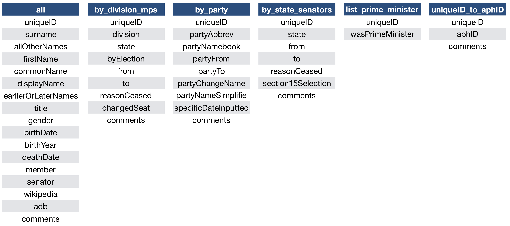
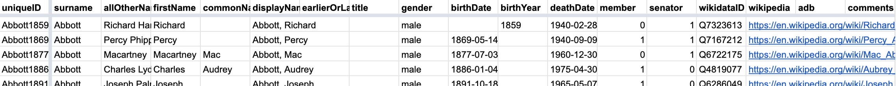
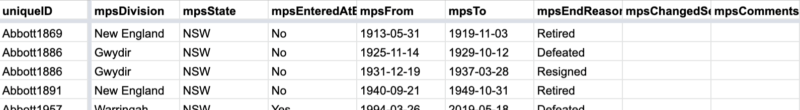
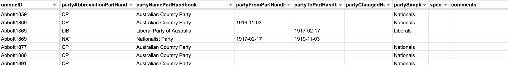
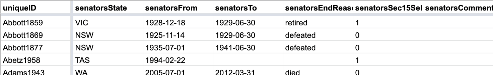
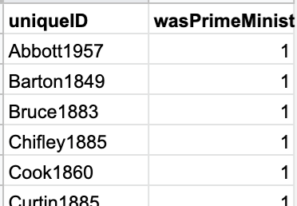
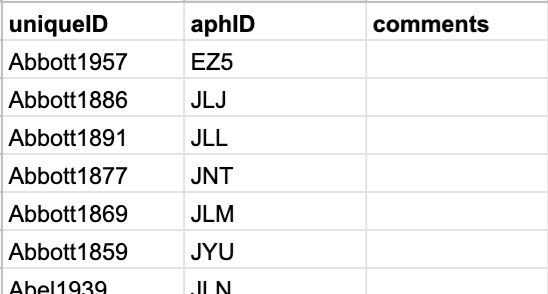

<!-- README.md is generated from README.Rmd. Please edit that file -->

# AustralianPoliticians

<!-- badges: start -->

[](https://travis-ci.org/RohanAlexander/AustralianPoliticians)
<!-- badges: end -->

`AustralianPoliticians` is a collection of datasets related to
Australian politicians. The datasets are:

  - all: The main dataset.
  - by\_division\_mps: Adds information about the division (‘seat’) of
    the politician.
  - by\_party: Adds information about the party of the politician.
  - by\_state\_senators: Adds information about the state that a senator
    was representing.
  - list\_prime\_ministers: Whether the politician was prime minister.
  - uniqueID\_to\_aphID: A correspondence between the uniqueIDs used in
    these datasets and the IDs used by the Australian Parliament House.



The datasets are up-to-date as of 26 August 2019.

## Installation

You can install this package from GitHub with:

``` r
# install.packages("devtools")
devtools::install_github("RohanAlexander/AustralianPoliticians")
```

## Example

This is a example of how to load the data:

``` r
library(tidyverse)

devtools::install_github("RohanAlexander/AustralianPoliticians")

all <- AustralianPoliticians::all %>% as_tibble()
by_division_mps <- AustralianPoliticians::by_division_mps %>% as_tibble()
by_party <- AustralianPoliticians::by_party %>% as_tibble()
by_state_senators <- AustralianPoliticians::by_state_senators %>% as_tibble()
list_prime_ministers <- AustralianPoliticians::list_prime_ministers %>% as_tibble()
uniqueID_to_aphID <- AustralianPoliticians::uniqueID_to_aphID %>% as_tibble()
```

You could then combine the tables using left\_join:

``` r
all_individuals_with_their_division <- all %>% 
  left_join(by_division_mps, by = c("uniqueID"))
```

## Dataset details

### all

This is the main dataset and contains one row per politician, with
columns: uniqueID, surname, allOtherNames, firstName, commonName,
displayName, earlierOrLaterNames, title, gender, birthDate, birthYear,
deathDate, member, senator, wikipedia, adb, and comments.



uniqueID is usually the surname of the politician and the year that they
were born, e.g. Abbott1859. In certain cases this is not enough to
uniquely identify them and then we add the first name,
e.g. AndersonCharles1897 and AndersonGordon1897. In cases where there
is punctuation in the surname, e.g. Ashley-Brown or O’Brien, this has
been removed but capitalisation has been retained, so those would become
AshleyBrown or OBrien, respectively.

commonName is used to highlight the name that the politician tended to
be known as e.g. Ted instead of Edward This is used in displayName which
is a politicians surname and their common name (if they had one) or
first name e.g. Abbott, Richard. In cases where this would not be
unique, e.g. Francis Baker, an additional name has been added.

earlierOrLaterNames is mostly used to keep track of women changing their
names at marriage. Similarly, title is mostly used to keep track of
‘Dr’, but both have been used inconsistently and should be only used
sparingly.

Some politicians don’t have a complete birth date, and instead only have
a year of birth. In these cases their entry for birthDate will be empty,
but they will have a birthYear. All death dates are complete, but in the
case of one politician – John William Croft – this has been inputted, as
the circumstances and timing (even year) of his death are unknown.

member and senator are binary indicator variables used to signify
whether the politician was in the lower or upper house. Most politicians
are only in one or the other, but some were in both. One politician in
the dataset was neither a senator nor an MP - Heather Elaine Hill. She
remains in the dataset because she was elected to the senate, and the
need for this dataset to exactly match the AustralianElections one),
however her eligibility was challenged and her election was invalidated,
so she was never a senator.

### by\_division\_mps

This dataset adds information about the division (‘seat’) of the
politician. One row per division-politician, with columns: uniqueID,
division, state, byElection, from, to, reasonCeasedToBeMember,
changedSeat, and comments.



Certain divisions change name. Sometimes this is minor, for instance
Kingsford-Smith to Kingsford Smith, and sometimes it is total. In all
cases this is being treated as change in division – the politician is
treated as finishing with one division and moving to another – but
changedSeat can be used to identify these cases and adjust for them if
necessary.

byElection is a binary indicator variable as to whether the politician
was entering the seat following a by-election.

changedSeat is a binary indicator variable as to whether the politician
left a division because they were changing the division, as opposed to
losing an election or retiring.

### by\_party

This dataset adds information about the party of the politician. One row
per party-politician, with columns: uniqueID,
partyAbbreviationParlHandbook, partyNameParlHandbook,
partyFromParlHandbook, partyToParlHandbook, partyChangedName,
partySimplified, specificDateWasInputted, and comments.



Party can be a little confusing in cases where a politician changed
party. In general, in this dataset, the to/from dates are set-up so that
when a politician is in parliament they will have the correct party.
However the dataset should not be used to say anything about when they
are out of parliament. For instance, some politicians lost their seat,
changed party, and then regained a seat in parliament. The dataset does
not know when they changed party while they were out of parliament, and
it assumes that they changed party either at the same time that they
lost their seat or at the same time as they re-gained a seat. Similarly,
there are plenty of cases where a politician has ceased being a member
after they leave parliament, for instance, Malcolm Fraser left the
Liberals. Again, that is not reflected in the dataset.

Certain parties, such as the Nationals, changed their name at various
points in time. This is included as a party change for people at that
time in partyAbbreviationParlHandbook and partyNameParlHandbook.
However, partySimplified abstracts away from that.

Party name changes:

  - The Country Party changed to the National Country Party on 3 May
    1975 according to <http://nla.gov.au/nla.news-article110636121>. It
    then changed from the National Country Party to the National Party
    of Australia on 17 October 1982 according to
    <http://nla.gov.au/nla.news-article116476081>. And finally, it
    changed from the National Party of Australia to The Nationals on 11
    October 2003 according to the party website.
  - The Nick Xenophon Team changed to Centre Alliance on 10 April 2018,
    according to ABC news reports.

### by\_state\_senators

This dataset adds information about the state that a senator was
representing. It is fairly similar to by\_division\_mps, expect that it
also has section15Selection. This is a binary indicator variable and
indicates whether the senator has been appointed rather than elected.



### list\_prime\_ministers

This dataset adds information about whether the politician has been
prime minister. One row per politician, with columns: uniqueID,
wasPrimeMinister.



### uniqueID\_to\_aphID

This dataset adds a correspondence between the unique identifiers used
in these datasets and the identifier used by the Australian Parliament
House on its website. the main issue with the APH identifier is that it
is not clear who it is referring to without looking it up. Additionally,
in certain cases it changes from time to time, and it is easy to
accidently change the format by opening it in Excel.



## TODO

  - all: The most recent entrants have incomplete uniqueIDs because
    their birthdays haven’t been published yet. This needs to be updated
    as soon as the birthdays are released. Also deathDate needs to be
    checked, and title needs to modified.
  - list\_prime\_ministers: Need to add the dates.

## Roadmap

  - Add dataset of ministers with dates.
  - Add information about birthplace and education to all.
  - Add information about relationships, for instance father-son, etc to
    all.

## Sources

In the first instance, the Parliamentary Handbook was the main source of
information. This was augmented with information from Wikipedia, the
Australian Dictionary of Biography, and the Senate Biographies wherever
possible. Limited information was obtained from other sources, such as
state parliaments and newspapers (via Trove), and these have generally
been specified in the comments. The uniqueID\_to\_aphID dataset was
primarily drawn from a dataset put together by Patrick Leslie, but it
was checked against a modern dataset from [Open
Australia](https://github.com/openaustralia/openaustralia-parser/blob/master/data/people.csv),
and Tim Sherratt’s Historic Hansard records for the
[Reps](http://historichansard.net/hofreps/people/) and
[Senate](http://historichansard.net/senate/people/).
